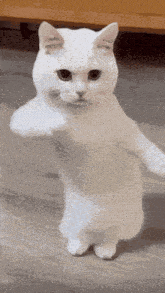

<!-- ###

  

 -->

###
# <h1> Hi there  :wave:. This is Duc Anh:octocat: </h1>
###

 
<b> <i> I’m an AI researcher focused on building solutions that positively impact everyday life. </i> </b> 

 

 

###
<h2 align="left">
  :information_desk_person: About me
</h2>

- 
 :mag: Currently, I'm interested in multimodal learning and its applications. 

- 
 :raised_hands: I'm open to collaborating on machine learning and AI projects. 
  
- 
  :soccer: Just a fun fact, I’m a fan of Manchester United.  

###
<h2 align="left">
  :speech_balloon: Contact me via
</h2>

  <a href="https://www.linkedin.com/in/ndapham/">   
  <a href="https://x.com/ndapham00">  
  <a href="pducanh2000@gmail.com">  

###

  

###

